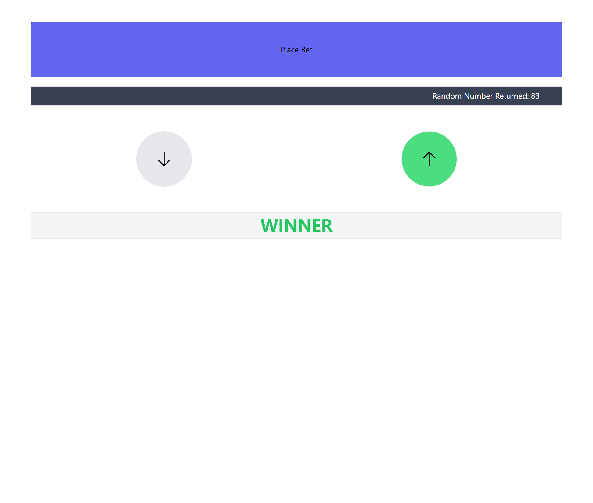

  <a href="https://tailwindcss.com" target="_blank">
    <picture>
      <source media="(prefers-color-scheme: dark)" srcset="https://raw.githubusercontent.com/tailwindlabs/tailwindcss/HEAD/.github/logo-dark.svg">
      <source media="(prefers-color-scheme: light)" srcset="https://raw.githubusercontent.com/tailwindlabs/tailwindcss/HEAD/.github/logo-light.svg">
      
    </picture>
  </a>

  A utility-first CSS framework for rapidly building custom user interfaces.

# [React](https://reactjs.org/) &middot;    

React is a JavaScript library for building user interfaces.

First Draft

Final Result

